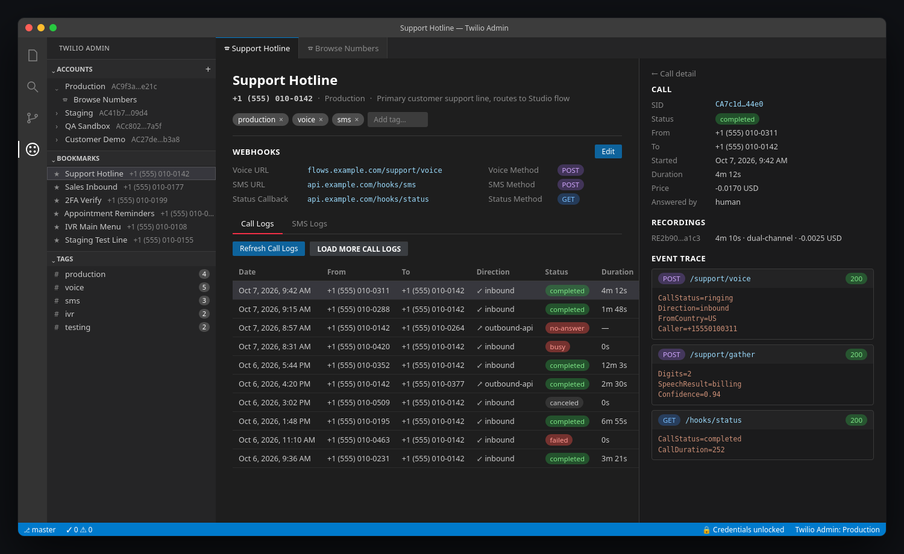

# Twilio Admin

A VS Code extension for managing Twilio phone numbers across multiple subaccounts — without leaving your editor.

Twilio Admin is a local, single-user tool. It requires no backend service, no Docker, and no database. All data is stored on your local filesystem, and auth tokens are encrypted at rest using your OS keychain.

## Features

- **Accounts** — add, edit, and delete Twilio subaccounts; credentials are never stored in plaintext
- **Number browsing** — list all incoming phone numbers for any subaccount
- **Bookmarks** — pin important numbers with a label, notes, and tags for quick access
- **Webhook editor** — view and update voice, SMS, and status callback URLs and HTTP methods
- **Call & SMS logs** — review recent activity for any bookmarked number
- **Call detail** — inspect call metadata, recordings, and the full request/response event sequence
- **Tag filtering** — filter your bookmarks by tag from the Tags tree view

## Requirements

- VS Code 1.85 or later
- A Twilio account with one or more subaccounts

## Installation

Install from a `.vsix` file:

1. Open the Command Palette (`Ctrl+Shift+P` / `Cmd+Shift+P`) and run **Extensions: Install from VSIX...**.
2. Select the `.vsix` file.
3. Reload VS Code when prompted.

## Getting started

### 1. Add an account

Open the **Twilio Admin** panel in the Activity Bar (the icon in the left sidebar). In the **Accounts** view, click the **+** button or run **Twilio Admin: Add Account** from the Command Palette.

You will be prompted for:

| Field | Description |
|---|---|
| Friendly name | A display label — e.g. "Production" or "Staging" |
| Account SID | Your Twilio Account SID (starts with `AC`) |
| Auth Token | Your Twilio Auth Token — encrypted immediately, never logged |

### 2. Browse and bookmark numbers

Right-click an account in the **Accounts** tree and choose **Browse Numbers**. A webview panel opens listing all incoming phone numbers for that account. Click **Bookmark** on any number, give it a label, and it appears in the **Bookmarks** tree.

### 3. Edit webhooks

Click a bookmark in the **Bookmarks** tree to open the detail panel. The webhook form lets you update voice URL, voice method, SMS URL, SMS method, and status callback URL directly from VS Code.

### 4. View logs

In the bookmark detail panel, switch between the **Call Logs** and **SMS Logs** tabs. Click any call row to load its full detail, recordings, and event trace.

### 5. Lock and unlock credentials

Run **Twilio Admin: Lock Credentials** to clear auth tokens from memory. On next use, the extension re-reads them from the OS keychain (or prompts for your passphrase if the keychain is unavailable). Locking is automatic when VS Code closes.

## Privacy and security

Auth tokens are encrypted with AES-256-GCM and protected by your OS keychain (Windows Credential Manager, macOS Keychain, or Linux libsecret). If the keychain is unavailable, a passphrase you choose is used instead and is never saved. No data leaves your machine except direct HTTPS calls to `api.twilio.com`.

## Settings

| Setting | Default | Description |
|---|---|---|
| `twilioAdmin.logs.pageSize` | `50` | Number of log entries fetched per request |
| `twilioAdmin.cache.enabled` | `true` | Cache API responses to disk |
| `twilioAdmin.cache.ttlSeconds` | `120` | Cache time-to-live in seconds |
| `twilioAdmin.security.requireUnlockOnStartup` | `true` | Unlock credentials automatically when VS Code starts |
| `twilioAdmin.security.passphraseFallbackEnabled` | `true` | Allow passphrase-based unlock when OS keychain is unavailable |

## Commands

All commands are available via the Command Palette (`Ctrl+Shift+P`) under the `Twilio Admin` category.

| Command | Description |
|---|---|
| `Twilio Admin: Add Account` | Add a new Twilio subaccount |
| `Twilio Admin: Edit Account` | Update a subaccount's name, SID, or auth token |
| `Twilio Admin: Delete Account` | Remove an account and all its bookmarks |
| `Twilio Admin: Browse Numbers` | Open the number browser for an account |
| `Twilio Admin: Open Bookmark` | Open the detail panel for a bookmarked number |
| `Twilio Admin: Edit Webhooks` | Jump directly to the webhook form in the detail panel |
| `Twilio Admin: Refresh Call Logs` | Force-refresh call logs for the open bookmark |
| `Twilio Admin: Refresh SMS Logs` | Force-refresh SMS logs for the open bookmark |
| `Twilio Admin: Lock Credentials` | Clear auth tokens from memory |
| `Twilio Admin: Unlock Credentials` | Reload auth tokens from the OS keychain or passphrase |

## Contributing and development

Build instructions, project structure, release process, and storage internals are in [docs/REFERENCE.md](docs/REFERENCE.md).

## Screenshot

*Illustrative mockup using sample data.*
